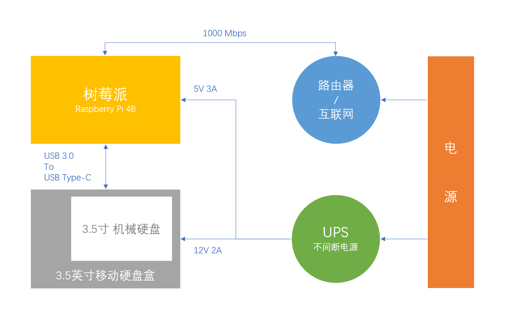

# RaspberryPi-NAS

基于树莓派的网络附加存储和下载装置及媒体中心。

## 硬件设备说明



* Raspberry Pi 4B 4GB
* MicroSD存储卡 64GB
* Type-C 5V3A 电源
* MicroHDMI 转 HDMI 视频线
* 超五类或更高等级的网线
* 硬盘
* 硬盘盒/硬盘仓（尺寸应于硬盘一致、建议使用 Type-C 接口的硬盘盒）

树莓派的USB接口通常电压较低，可能无法带动普通的移动硬盘，因此请使用带独立供电的硬盘盒。
树莓派4B升级成Type-c供电，也许可以直接用移动硬盘？

## 软件说明

### 使用的软件

系统：[Raspbian](https://www.raspberrypi.org/downloads/raspbian/)
语言：[PHP7](http://php.net/) and [Python3](https://www.python.org/)
网络共享：NFS（Linux）/ Samba（Windows）
远程控制：OpenSSH
NTFS磁盘读写：NTFS-3G
Web服务器：[Nginx](http://nginx.org/)
下载：[Aria2](https://github.com/aria2/aria2)
Aria2前端：[AriaNg](http://ariang.mayswind.net/)
数据库：[SQLite](http://www.sqlite.org)

***可选***
*私有云：[NextCloud](https://nextcloud.com/)*
*媒体中心：[Kodi](https://kodi.tv/)*
*版本控制：[Git](https://git-scm.com/)*
*内网穿透：[Ngrok](https://ngrok.com/)*
nextcloud 在树莓派上没安装成功过，很迷。
Kodi的作用是树莓派可以直接连接电视，并播放下载好的视频。
Git取决于想不想把代码放在自己家，我是觉得Gayhub挺好用的。
移动等不给公网ip的宽带需要ngrok来实现内网穿透，有公网ip可以直接在路由器中设置DDNS和端口转发。

### 使用的端口

**（需要在路由器内设置 DDNS 和端口转发）**
Web服务器：80/443
Aria2 RPC：6800
ssh：22

## 安装

安装并进入树莓派的操作系统后

```bash
# 请使用 root 账号进行安装
sudo bash ./install.sh
```

## 命令

```bash
# 更新Aria2使用的bt-track
# https://github.com/ngosang/trackerslist
update-bt-track

# 更新系统的/etc/hosts
# https://github.com/googlehosts/hosts
update-hosts
```

## 语言

建议中文用户使用 raspi-config 手动设置树莓派系统为zh_CN.UTF-8。

## 远程控制/访问

在路由器中设置 **DDNS** 和 **端口转发** 可实现公网访问。
由于路由器型号不同，在此不予说明，请根据 **路由器说明书** 或者 **Google / Baidu** 进行设置。

```text
## TP-Link 路由器
http(s)://DOMAIN.tpddns.cn:PORT/
(192.168.1.*)
```

*DOMAIN*：DDNS设置的二级域名
*PORT*：端口转发设置转发至内部80/443端口的外部端口

## 挂载 NFS 目录到主机

### Linux

```bash
# 查看 ip 地址 有线：enp4s0f1 无线：wlp3s0
ip addr

# 创建挂载目录
mkdir /mnt/Raspberry

# 挂载
mount.nfs 192.168.1.*:/rpinas /mnt/Raspberry

#设置开机挂载（请根据实际 ip 地址修改）
echo '192.168.1.*:/rpinas   /mnt/Raspberry  nfs     defaults,user   0   0' >> /etc/fstab
```

### Windows 10

```text
1. 设置 > 查找设置 > 启用或关闭 Windows 功能 > NFS 服务 > NFS 客户端
2. 此电脑 > 计算机 > 映射网络驱动器 > 驱动器：选一个可爱的盘符 > 文件夹：\\192.168.1.*\rpinas > 完成
```
